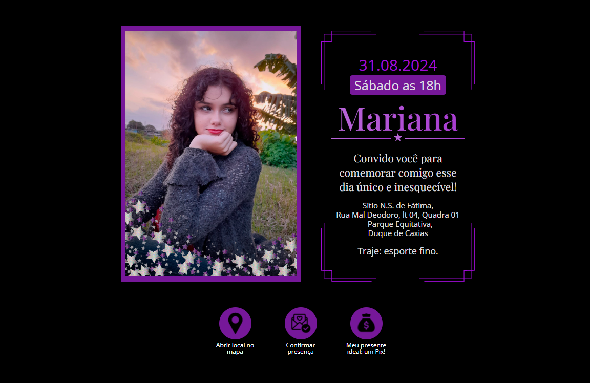

# Convite aniversário 15 anos 🎂



## 📁 Sobre o projeto

</p>
Convite interativo de aniversário de 15 anos para uma cliente.

- O projeto foi desenvolvido como uma SPA, usando JavaScript, React e SASS. Consistindo em 3 páginas:

1. Página Welcome:

```
Página de apresentação do convite, com uma saudação, o anúncio do aniversário e um botão para abrir o convite, que direciona o usuário para a página principal.
```

2. Página Invitation:

```
Página com o conteúdo principal do convite, que traz uma foto da aniversariante, informações sobre o aniversário, como data, hora, local e traje.
Contém também 3 botões funcionais, um permite abrir o local do evento no Google Maps, o outro possibilita uma conversa direta com a organização do evento para confirmação de presença e o terceiro direciona para a terceira página, onde o convidado encontrará os dados para fazer um pix de presente para a aniversariante.
```

3. Página Pix:

```
Página que contém um QRCode e uma chave pix para o convidado enviar de presente para a aniversariante.
```

#

## 🔧 Tecnologies

 HTML
 JavaScript
 sass
 React.js

<!-- #

## 💡 Access ⬇

[🔗 Deploy 💻](https://sp-labs-six.vercel.app/) -->
